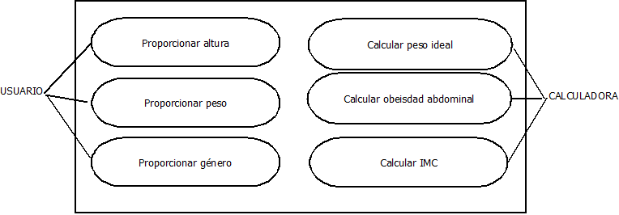

# BMI calculator
A biomedical calculator for the body mass index (BMI) and other parameters.

## Tests
### bmi Test
1. `assertEquals((70)/(1.75*1.75), test.bmi(70, 1.75));` Test a known problem ().
2. `assertThrows(RuntimeException.class, () ->{test.bmi(-70, 1.75);});` Test if an error message appears when height or mass is under 0.
3. `assertThrows(RuntimeException.class, () ->{test.bmi(70, 0);});` Test if an error message appears when height or mass is equal to 0.

### category Test
1. `assertThrows(RuntimeException.class, () ->{test.category(-10);});` Test if an error message appears when bmi is under 0.
2. `assertThrows(RuntimeException.class, () ->{test.category(0);});` Test if an error message appears when bmi is equal to 0.
3. `assertEquals("UNDERWEIGHT", test.category(17));` Test if value under 18.5 is UNDERWEIGHT
4. `assertEquals("NORMAL", test.category(18.5));` Test if value equal to 18.5 is NORMAL
5. `assertEquals("OVERWEIGHT", test.category(25));` Test if value equal to 25 is OVERWEIGHT
6. `assertEquals("OBESE", test.category(30));` Test if value equal to 30 is OBESE
7. `assertEquals("OBESE", test.category(34));` Test if value over 30 is OBESE

### abdominalObesity Test
1. `assertThrows(RuntimeException.class, () ->{test.abdominalObesity(-23, 'M');});` Test if an error message appears when waistCircumference is under 0.
2. `assertThrows(RuntimeException.class, () ->{test.abdominalObesity(0, 'M');});` Test if an error message appears when waistCircumference is equal to 0.
3. `assertThrows(RuntimeException.class, () ->{test.abdominalObesity(23, 'c');});` Test if gender is male or female.

## Casos de uso

### Calcular IMC
- Actor primario: Paciente (usuario)
- Objetivo: El paciente obtiene si está bajo de peso, normal, con sobrepeso u obeso.
- Ámbito: Sistema del hospital
- Nivel: Objetivo del usuario
- Stakeholder e intereses: 
    1. Paciente: interesado en saber su estado
    2. Hospital: calcular rápidamente el IMC del paciente.
-  Precondición: Conocer los datos de altura y peso del paciente.
- Garantía mínima: Dar el cálculo del IMC
- Trigger: Introducir los datos de altura y peso
- Escenario principal: 
    1. El paciente introduce su peso y altura
    2. El sistema calcula el IMC 
    3. El sistema devuelve al usuario el resultado 
- Escenarios alternativos:
    - 1a) El paciente introduce un peso o altura igual o menor a cero
    - 1b) El sistema devuelve un mensaje de error
    - 1c) Vuelta al paso 1.

## Historias de usuario
1. Como usuario, quiero poder ingresar mi altura y peso para calcular mi índice de masa corporal.

2. Como usuario, quiero que se me muestre mi índice de masa corporal e información de lo que significa ese número.

## Escenarios

1. Un usuario quiere calcular su índice de masa corporal. Abre la calculadora e ingresa su peso y altura. La calculadora muestra su BMI e información de lo que significa ese número.